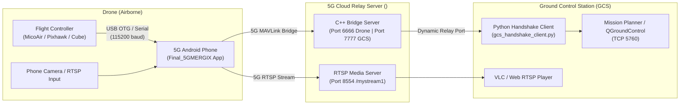

# 5G MERGIX 🛸

[](https://developer.android.com)
[](https://kotlinlang.org)
[](https://mavlink.io)
[](https://github.com/tanvikolvankar/5g-mergix)
[](LICENSE)

**5G MERGIX** is an enterprise-grade Android companion computer system for autonomous UAVs. It turns any 4G/5G Android smartphone into an onboard drone companion computer, providing simultaneous **ultra-low-latency H.264 RTSP video streaming** and **bi-directional MAVLink telemetry relay** across cellular networks to Mission Planner, QGroundControl, and remote command centers worldwide.

---

## ⚡ Key Highlights

- **Zero-Touch Auto Launch & Streaming:**  
  Plug the Flight Controller USB cable into the phone — the app automatically wakes the screen, pops up to the foreground (even from lock screen), connects to the flight controller, and begins streaming both **HD Video** and **MAVLink Telemetry** without tapping a single button.
- **Hardware-Accelerated RTSP Video Streaming:**  
  Powered by Pedro RootEncoder (`RtspCamera2`), capturing hardware-encoded H.264 video at 720p/1080p @ 30 FPS directly over 5G to your cloud media server (`:8554`).
- **Transparent Bi-directional MAVLink Bridge:**  
  Implements the exact state machine of the cloud bridge server (`drone_app_bridge.cpp`):
  1. Handshakes with Drone ID (`ajay@1`, `fahad@1`, `tanvi@1`).
  2. Maintains a 1 Hz keepalive ping (`0xFD`) protocol.
  3. Transitions into a high-speed transparent byte pipe upon receiving `"START RELAY"`.
- **Universal Flight Controller USB Detection:**  
  Custom prober supporting **MicoAir** (MicoAir405 / MicoAir743), **Hex Cube** (Orange+, Black), **3DR Pixhawk** (1/4/V5), **STM32 VCP**, **Matek**, **Holybro**, **FTDI**, **Silicon Labs CP210x**, and **CH340**. Asserts DTR/RTS lines to ensure immediate serial readiness.
- **Continuous MAVLink Stream Injector:**  
  Background daemon periodically injects `MAVLink REQUEST_DATA_STREAM` and `GCS Heartbeat` packets to force ArduPilot / PX4 to continuously stream attitude, GPS, battery, and telemetry streams at maximum rate.
- **Persistent Background Service:**  
  Android Foreground Service with high-priority sticky notification ensures uninterrupted transmission even when the screen turns off or another application is opened.
- **PC GCS Companion Client (`gcs_handshake_client.py`):**  
  Lightweight Python bridge running on your laptop / ground station that authenticates with cloud port `7777`, negotiates the dynamic relay port, and serves a local TCP server on `5760` for one-click connection in Mission Planner.

---

## 🏗️ System Architecture



---

## 📱 Application Screenshots & UI Features

The app features a tactical dark-mode dashboard built with **Jetpack Compose**:
- **Live Viewfinder Card:** Real-time camera preview with live FPS counter, resolution badge, and camera flipper.
- **Live Status Indicators:** Real-time pills for **FC Connection**, **Cloud Relay**, and **5G Video**.
- **Metrics Dashboard:** Live byte counters, packet counters, and bandwidth calculations for USB and Cloud.
- **Live Terminal:** Real-time scrolling diagnostics log with timestamps for instant debugging in the field.
- **Zero-Touch Config Modal:** Easy profile switching between registered drone IDs (`ajay@1`, `fahad@1`, `tanvi@1`).

---

## 🚀 Quick Start Guide

### 1. Build & Install the Android App
```bash
# Clone the repository
git clone https://github.com/tanvikolvankar/5g-mergix.git
cd 5g-mergix

# Build debug APK using Gradle
./gradlew assembleDebug

# Install on your Android phone via ADB
adb install -r app/build/outputs/apk/debug/app-debug.apk
```
*(Pre-compiled APK is also available in the repository root or project downloads).*

### 2. Connect to Flight Controller (Zero-Touch Launch)
1. Plug your USB OTG cable between the Android phone and the Flight Controller.
2. On first connection, check **"Always open Final 5GMERGIX"** and press **OK**.
3. The phone will immediately pop up and auto-start both video and telemetry streams.

### 3. Connect Mission Planner on PC
1. Run the Python companion script on your PC:
   ```bash
   python gcs_handshake_client.py --username ajay --drone_id ajay@1
   ```
   *(Or specify `--username fahad --drone_id fahad@1` depending on your active profile).*
2. Open **Mission Planner**:
   - Connection Type: **TCP**
   - Host: `127.0.0.1`
   - Port: `5760`
   - Click **Connect**!
3. To view video: Open VLC Media Player and open network stream:  
   `rtsp://<YOUR_CLOUD_SERVER_IP>:8554/mystream1`

---

## 🔌 Recommended Hardware & Power Setup

```
[Drone Main LiPo (4S/6S)]
       │
       ▼
 [5V 3A Step-Down BEC] ───(5V Power)───┐
                                       ▼
 [Flight Controller] ──────(Data D+/D-)──► [Powered OTG Y-Cable] ──► [Android Phone]
```

> [!IMPORTANT]
> **Always power the phone via an external 5V 3A BEC using an OTG Y-cable.**  
> Never attempt to draw phone charging power from the Flight Controller's internal 5V rail. Flight controller regulators are rated for low-current sensors only; drawing high phone-charging currents risks 5V brownout and in-flight crash.

---

## 📁 Repository Structure

```
├── app/
│   ├── src/main/java/com/example/final_5gmergix/
│   │   ├── MainActivity.kt               # Entry point, USB attachment listener & auto-starter
│   │   ├── CameraStreamManager.kt        # Pedro RootEncoder hardware video streamer & Ethernet relay
│   │   ├── TelemetryBridgeEngine.kt      # MAVLink prober, daemon stream requester & TCP relay
│   │   ├── MergixForegroundService.kt    # Background lockscreen persistence service
│   │   ├── MergixConfigManager.kt        # JSON configuration manager
│   │   ├── PythonRunnerEngine.kt         # Embedded script runner
│   │   └── ui/
│   │       ├── MergixDashboard.kt        # Jetpack Compose tactical UI & status indicators
│   │       └── theme/                    # High-tech color palette & typography
│   ├── src/main/res/xml/
│   │   └── device_filter.xml             # Universal USB device filter for auto-pop-up
│   └── build.gradle.kts                  # Android dependencies & build configuration
├── gcs_handshake_client.py               # PC Ground Control Station Python handshake bridge
├── settings.gradle.kts                   # Project repositories (MavenCentral, Google, JitPack)
└── README.md                             # Project documentation
```

---

## 📄 License
This project is licensed under the MIT License — see the [LICENSE](LICENSE) file for details.
